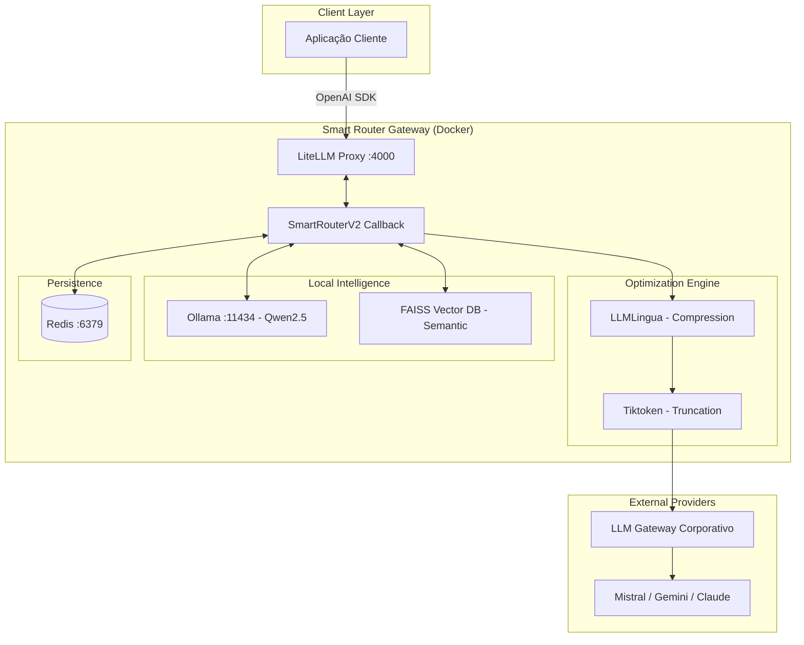
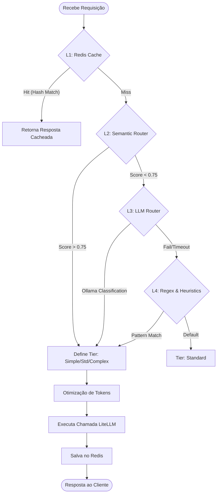

# SMART ROUTER LLM GATEWAY

---

## 1. Descrição do Projeto

O **Smart Router LLM Gateway** é uma solução avançada de infraestrutura para IA Generativa que atua como um proxy inteligente entre aplicações e múltiplos provedores de LLM. Construído sobre o **LiteLLM**, o sistema intercepta requisições compatíveis com a API da OpenAI e utiliza um pipeline de decisão em 4 camadas para rotear a consulta ao modelo mais eficiente em termos de custo-performance.

O diferencial deste gateway reside na sua capacidade de classificar a complexidade da consulta em tempo real, aplicando técnicas de compressão de prompt (**LLMLingua**) e truncamento inteligente de contexto (**Tiktoken**) antes de despachar a chamada para o provedor final através do gateway corporativo.

---

## 2. Arquitetura do Sistema

A arquitetura é baseada em microserviços orquestrados via Docker, garantindo isolamento e escalabilidade dos componentes de cache, classificação local e proxy.

### 2.1. Visão Geral dos Componentes



---

## 3. Pipeline de Roteamento (4 Camadas)

O sistema utiliza uma estratégia de "fail-fast" e "cache-first" para determinar o destino de cada prompt.

### 3.1. Fluxo de Decisão



### 3.2. Detalhamento das Camadas

1.  **Camada 1 - Redis Cache:** Normaliza o prompt (lowercase, strip) e gera um hash SHA-256. Verifica se existe uma decisão de rota (`route:{hash}`) válida por 24h ou uma resposta completa (`resp:{hash}`) válida por 1h.
2.  **Camada 2 - Semantic Router:** Utiliza `all-MiniLM-L6-v2` para gerar embeddings e compara via similaridade de cosseno (FAISS) contra 30 prompts de referência (10 por tier) em PT-BR e EN.
3.  **Camada 3 - LLM Router:** Consulta um modelo local `qwen2.5:1.5b` via Ollama para análise lógica da complexidade, esperando um JSON com `tier` e `confidence`.
4.  **Camada 4 - Regex Fallback:** Analisa palavras-chave técnicas (ex: "deadlock", "architecture" para complexo; "crud", "getter" para simples) e heurística de contagem de palavras (<15 simples, >80 complexo).

---

## 4. Modelos e Fallbacks

O mapeamento de tiers garante que tarefas simples não consumam créditos de modelos de alta performance.

| Tier | Modelo Principal | Fallback 1 | Fallback 2 |
| :--- | :--- | :--- | :--- |
| **Simple** | `mistral-small-2503` | `claude-4-5-haiku` | `gemini-2.5-flash` |
| **Standard** | `gemini-2.5-flash` | `gemini-3.1-pro` | `claude-4-5-haiku` |
| **Complex** | `gemini-3.1-pro` | `gemini-2.5-flash` | `claude-4-5-haiku` |

---

## 5. Otimização de Tokens

Para reduzir custos e latência, o gateway aplica duas técnicas antes do roteamento final:

*   **LLMLingua-2:** Prompts de sistema com mais de 500 caracteres são comprimidos usando o modelo `microsoft/llmlingua-2-bert-base-multilingual-cased-meetingbank` com uma taxa de 0.5.
*   **Tiktoken Truncation:** Garante que o contexto enviado não ultrapasse 4.000 tokens, mantendo as mensagens mais recentes e preservando a mensagem de sistema original.

---

## 6. Configuração e Instalação

### 6.0. Instalação via pip (alternativa ao Docker)

```bash
pip install smart-router-llm
```

Redis e Ollama continuam sendo responsabilidade sua instalar e rodar — o pacote só se conecta a eles, não os empacota nem gerencia.

```bash
# 1. Configure as variáveis de ambiente (mesmas da seção 6.2)
export LLM_GATEWAY_API_KEY=seu_token_aqui
export LLM_GATEWAY_BASE_URL=sua_url_aqui

# 2. Verifica se Redis e Ollama estão acessíveis
smart-router check

# 3. Baixa os modelos Ollama necessários e cria o modelo classificador
smart-router pull-models

# 4. Valida conectividade com o gateway corporativo
smart-router validate

# 5. Sobe o proxy (porta 4000)
smart-router serve
```

### 6.1. Pré-requisitos

*   Docker & Docker Compose
*   Python 3.12+ (para execução local)
*   Chave de API do gateway LLM corporativo

### 6.2. Variáveis de Ambiente (.env)

Crie um arquivo `.env` na raiz do projeto:

```bash
LLM_GATEWAY_API_KEY=seu_token_aqui
LLM_GATEWAY_BASE_URL=sua_url_aqui
REDIS_HOST=redis
REDIS_PORT=6379
OLLAMA_HOST=http://ollama:11434
OLLAMA_MODEL=qwen2.5:1.5b
LITELLM_MASTER_KEY=sk-litellm-local
```

### 6.3. Comandos do Makefile

O projeto utiliza um `Makefile` para simplificar a gestão:

*   `make .venv`: Cria o ambiente virtual com Python 3.12.
*   `make install`: Instala as dependências no ambiente virtual.
*   `make up`: Sobe toda a infraestrutura (Redis, Ollama, LiteLLM).
*   `make down`: Encerra todos os serviços.
*   `make logs`: Acompanha os logs do proxy em tempo real.
*   `make validate`: Valida a conectividade com os modelos do gateway.
*   `make clean`: Limpa caches, logs e arquivos temporários.

---

## 7. Estrutura do Projeto

```text
.
├── app/
│   ├── cache/          # Singleton Redis e lógica de hashing
│   ├── optimization/   # Implementação LLMLingua e Tiktoken
│   ├── router/         # Lógica das 4 camadas de roteamento
│   ├── utils/          # Sanitização e extração de prompts
│   └── main.py         # Ponto de entrada LiteLLM Proxy
├── ollama/
│   └── Modelfile       # Configuração do modelo de classificação
├── scripts/            # Scripts de inicialização e validação
├── config.yaml         # Definição de modelos e fallbacks LiteLLM
├── docker-compose.yml  # Orquestração de serviços
├── Makefile            # Atalhos de automação
└── venv/               # Ambiente virtual
```

---

## 8. Utilização da API

O gateway expõe um endpoint compatível com OpenAI na porta `4000`.

**Exemplo de requisição via cURL:**

```bash
curl http://localhost:4000/v1/chat/completions \
  -H "Content-Type: application/json" \
  -H "Authorization: Bearer sk-litellm-local" \
  -d '{
    "model": "smart-router",
    "messages": [
      {"role": "system", "content": "Você é um arquiteto de software."},
      {"role": "user", "content": "Explique a diferença entre consistência eventual e forte em sistemas distribuídos."}
    ]
  }'
```

Nota: Ao enviar para o modelo "smart-router", o sistema automaticamente reescreverá o campo "model" para o tier adequado (ex: gemini-3.1-pro) antes de processar.

---

## 9. Monitoramento e Estatísticas

O sistema mantém métricas de performance no Redis sob a hash `router:stats`. É possível monitorar:

*   `total_requests`: Total de chamadas processadas.
*   `cache_hits`: Quantidade de respostas servidas pelo cache.
*   `routing_decisions`: Distribuição de roteamento por tier (simple/standard/complex).

*Documento elaborado em 06 de agosto de 2026. As informações contidas são de responsabilidade do solicitante.*